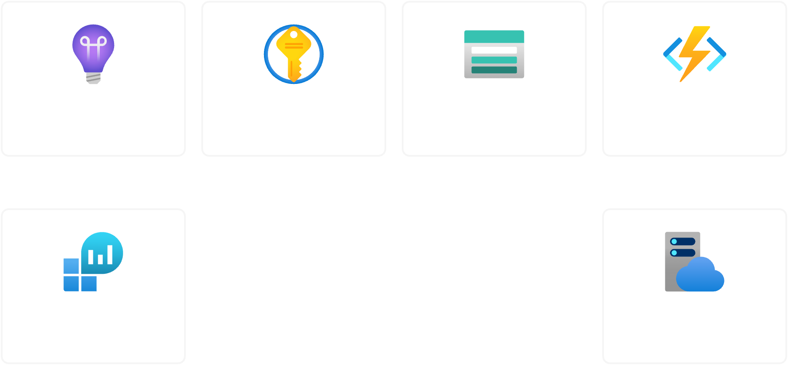

# Python Function App

This module deploys a Python Function App along with its source code to Azure. It creates the necessary resources such as a resource group, storage account, service plan, application insights, log analytics workspace, and key vault. The module also handles the deployment of the Python source code and sets up environment variables.



## Usage
- Point the `python_source_code` variable to the path of your Python source code. This should be a relative path to the module root.
- Set any required environment variables in the `environment_variables` variable.
- If you have any sensitive environment variables, list them in `secret_environment_variables`. The module will create secrets in the Azure Key Vault and attach them to the function app. You will need to manually set the values in the Key Vault.

> Note: `secret_environment_variables` are converted to lowercase and any underscores are replaced with hyphens. For example, `MY_SECRET_VAR` will be stored as `my-secret-var` in the Key Vault.

<!-- BEGIN_TF_DOCS -->


## Example

```hcl
module "terraform_azurerm_python_function" {
  source = "../../"

  location = "Australia East"

  resource_group_name       = "tapf-example-rg"
  function_app_name         = "tapf-example-func"
  storage_account_name      = "tapfexamplestorage"
  log_analytics_name        = "tapf-example-law"
  app_service_plan_name     = "tapf-example-asp"
  application_insights_name = "tapf-example-ai"
  key_vault_name            = "tapf-example-kv"

  python_version = "3.11"

  # must be a relative path to ${path.module}
  python_source_code = "src"

  environment_variables = {
    EXAMPLE_ENV_1 = "example_value_1"
    EXAMPLE_ENV_2 = "example_value_2"
  }

  secret_environment_variables = [
    "EXAMPLE_SECRET_1",
    "EXAMPLE_SECRET_2",
  ]
}
```

## Inputs

| Name | Description | Type | Default | Required |
|------|-------------|------|---------|:--------:|
| <a name="input_app_service_plan_name"></a> [app\_service\_plan\_name](#input\_app\_service\_plan\_name) | The name of the service plan. | `string` | n/a | yes |
| <a name="input_application_insights_name"></a> [application\_insights\_name](#input\_application\_insights\_name) | The name of the application insights. | `string` | n/a | yes |
| <a name="input_function_app_name"></a> [function\_app\_name](#input\_function\_app\_name) | The name of the function app. | `string` | n/a | yes |
| <a name="input_key_vault_name"></a> [key\_vault\_name](#input\_key\_vault\_name) | The name of the key vault. | `string` | n/a | yes |
| <a name="input_log_analytics_name"></a> [log\_analytics\_name](#input\_log\_analytics\_name) | The name of the log analytics workspace. | `string` | n/a | yes |
| <a name="input_python_source_code_path"></a> [python\_source\_code\_path](#input\_python\_source\_code\_path) | (Required) The path to the Python source code. | `string` | n/a | yes |
| <a name="input_python_version"></a> [python\_version](#input\_python\_version) | (Required) The version of Python to run. Possible values are 3.13, 3.12, 3.11, 3.10, 3.9, 3.8 and 3.7 | `string` | n/a | yes |
| <a name="input_resource_group_name"></a> [resource\_group\_name](#input\_resource\_group\_name) | The name of the resource group. | `string` | n/a | yes |
| <a name="input_storage_account_name"></a> [storage\_account\_name](#input\_storage\_account\_name) | The name of the storage account. | `string` | n/a | yes |
| <a name="input_environment_variables"></a> [environment\_variables](#input\_environment\_variables) | (Optional) A map of environment variables to be passed to the function app. | `map(string)` | `{}` | no |
| <a name="input_location"></a> [location](#input\_location) | The Azure region to deploy resources in. | `string` | `"Australia East"` | no |
| <a name="input_python_source_code_excludes"></a> [python\_source\_code\_excludes](#input\_python\_source\_code\_excludes) | (Optional) A list of files or directories to exclude from the source code zip file. | `list(string)` | <pre>[<br>  ".venv",<br>  ".git",<br>  ".gitignore",<br>  "__pycache__",<br>  ".DS_Store"<br>]</pre> | no |
| <a name="input_secret_environment_variables"></a> [secret\_environment\_variables](#input\_secret\_environment\_variables) | (Optional) A list of secrets to be passed to the function app, you will need to set the values in the key vault. | `list(string)` | `[]` | no |
| <a name="input_tags"></a> [tags](#input\_tags) | (Optional) A map of tags to assign to the resources. | `map(string)` | `{}` | no |

## Outputs

| Name | Description |
|------|-------------|
| <a name="output_default_hostname"></a> [default\_hostname](#output\_default\_hostname) | The default hostname of the Linux Function App |
| <a name="output_function_app_id"></a> [function\_app\_id](#output\_function\_app\_id) | The ID of the Linux Function App |
| <a name="output_function_app_name"></a> [function\_app\_name](#output\_function\_app\_name) | The name of the Linux Function App |
| <a name="output_principal_id"></a> [principal\_id](#output\_principal\_id) | The identity of the Linux Function App |
| <a name="output_resource_group_name"></a> [resource\_group\_name](#output\_resource\_group\_name) | The name of the resource group |

## Providers

| Name | Version |
|------|---------|
| <a name="provider_archive"></a> [archive](#provider\_archive) | 2.7.0 |
| <a name="provider_azurerm"></a> [azurerm](#provider\_azurerm) | 4.25.0 |

## Requirements

| Name | Version |
|------|---------|
| <a name="requirement_terraform"></a> [terraform](#requirement\_terraform) | ~> 1.11 |
| <a name="requirement_archive"></a> [archive](#requirement\_archive) | ~> 2.0 |
| <a name="requirement_azurerm"></a> [azurerm](#requirement\_azurerm) | ~> 4.23 |
| <a name="requirement_http"></a> [http](#requirement\_http) | ~> 3.0 |


<!-- END_TF_DOCS -->
